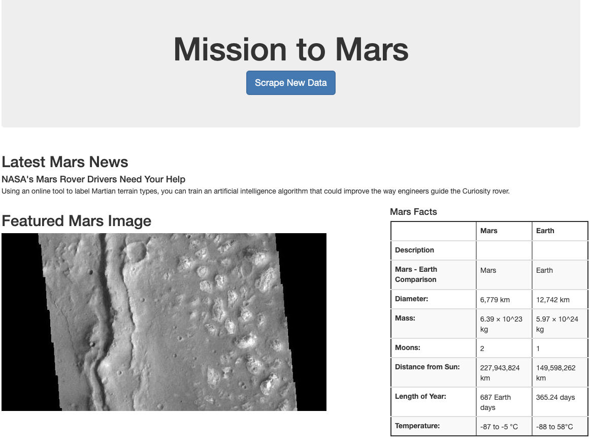

# Web Scraping Project - Mission to Mars


## Task

In this project, a web application is developed that scrapes various websites for data related to the Mission to Mars and displays the information in a single HTML page. The initial scraping is completed using Jupyter Notebook, BeautifulSoup, Pandas, and Requests/Splinter.


* A Jupyter Notebook file is created called `mission_to_mars.ipynb` to complete all of the scraping and analysis tasks. 

* The [Mars News Site](https://redplanetscience.com) is scraped and the latest News Title and Paragraph Text is collected and assigned to the relevant variables. 

```python
# Example:
news_title = "NASA's Next Mars Mission to Investigate Interior of Red Planet"

news_p = "Preparation of NASA's next spacecraft to Mars, InSight, has ramped up this summer, on course for launch next May from Vandenberg Air Force Base in central California -- the first interplanetary launch in history from America's West Coast."
```

### JPL Mars Space Images - Featured Image

* Splinter is used to navigate the url for the Featured Space Image site [here](https://spaceimages-mars.com) and find the image url for the current Featured Mars Image.

### Mars Facts

* In the Mars Facts webpage [here](https://galaxyfacts-mars.com), Pandas is used to scrape the table containing facts about the planet including Diameter, Mass, etc and to convert the data to a HTML table string.

### Mars Hemispheres

* The Astrogeology site [here](https://marshemispheres.com) is used to obtain high resolution images for each of Mar's hemispheres.

* Both the image url string for the full resolution hemisphere image, and the Hemisphere title containing the hemisphere name is saved and assigned to a Python dictionary.

## MongoDB and Flask Application

MongoDB with Flask templating is used to create a new HTML page that displays all of the information that was scraped from the URLs above.

* The Jupyter notebook is converted into a Python script called `scrape_mars.py` with a function called `scrape` that will execute all of the scraping code from above and return one Python dictionary containing all of the scraped data.

* A template HTML file called `index.html` is created that will take the mars data dictionary and display all of the data in the appropriate HTML elements. 




- - -

